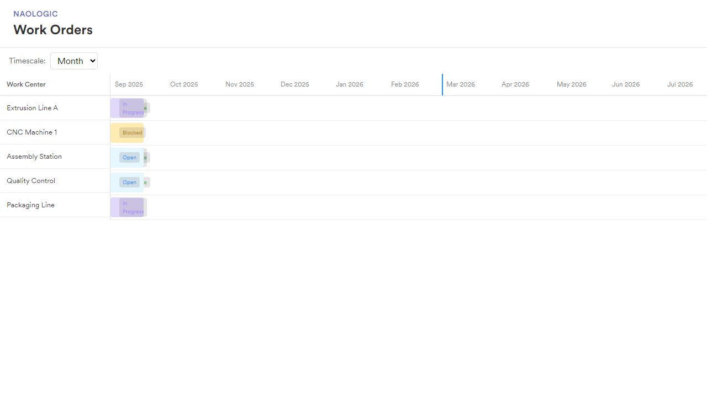

# Work Order Schedule Timeline

An interactive timeline application for visualizing and managing work orders across manufacturing work centers. Built with **Angular 20** (LTS), it provides planners with an intuitive Gantt-style view to schedule, create, edit, and filter work orders with overlap validation and keyboard navigation.



---

## How to Run

### Setup

```bash
cd work-order-schedule
npm install
```

### Run the Application

```bash
ng serve
```

Open [http://localhost:4200](http://localhost:4200) in your browser. No additional setup (e.g. database or API) is required—work orders load from JSON and persist to `localStorage`.

---

## Approach

### Development Workflow

1. **Requirements → wireframe** — Transcode and compile requirements into a wireframe for further refinement.
2. **Composition & polish** — Once the wireframe resembles the target design, focus on compositional-level components and refine the UI with minimal sample data.
3. **Volume & performance** — Increase data volume and optimize for performance.

### Testing

Test coverage focuses on **behaviors** and **component integration** — verifying how components work together and that user-facing behavior matches expectations, rather than implementation details.

### Decision Reinforcement

Key decisions are documented as **Architecture Decision Records (ADRs)** in `docs/adr/`. Each ADR has a matching **Cursor rule** in `.cursor/rules/` so that decisions are reinforced during development and consistently applied by tooling. This pairing ensures that documented decisions are not just reference material but actively shape the codebase.

---

## Feature Highlights

### Timeline & Zoom

- **Four zoom levels**: Hours, Day, Week, Month — switch via the Timescale dropdown
- **Scroll-wheel zoom**: Hold **Ctrl** and scroll to zoom in/out (month → week → day → hours)
- **Drag to pan**: Click and drag on the timeline to scroll horizontally (scrollbar hidden for a clean look)
- **Current day indicator**: Vertical line marks today’s date
- **Date tooltip**: Hover over the timeline to see the date/time under the cursor (hidden over the work center column)

### Work Order Management

- **Create**: Click an empty area on a work center row — the panel opens with the start date pre-filled from the click position
- **Edit**: Hover a work order bar, click the ⋮ menu, then **Edit**
- **Delete**: Same menu → **Delete**
- **Overlap validation**: The system blocks overlapping work orders on the same work center and shows an error message

### Filtering

- **Name filter**: Filter work centers by name (case-insensitive)
- **Date range filter**: Filter by start date, end date, or both — show only work centers with orders overlapping the selected range
- **Escape**: Press **Escape** to close the filter dropdown

### Keyboard & Accessibility

- **Arrow keys**: Focus a work order bar (by clicking it), then use ↑ ↓ ← → to move between bars
- **WCAG 2.1 AA**: Semantic structure, keyboard access, screen reader support, and focus management

### Persistence

- **localStorage**: Work orders are saved automatically and persist across page refreshes
- **Reset**: Add `?reset=1` to the URL to clear stored data and reload from the default JSON

---

## User Guide

**[→ Full User Guide with screenshots](work-order-schedule/docs/USER-GUIDE.md)**

### Changing the Timescale

Use the **Timescale** dropdown (top right) to switch between:

| Level  | Best for                    |
|--------|-----------------------------|
| Month  | Planning across quarters    |
| Week   | Near-term scheduling        |
| Day    | Detailed daily view         |
| Hours  | Hour-by-hour planning       |

### Creating a Work Order

1. **Click** an empty area on a work center row. A hint “Click to add dates” appears on hover.
2. The **Work Order Details** panel opens from the right with the start date pre-filled.
3. Fill in:
   - **Work Order Name** (required)
   - **Status** (Open, In Progress, Complete, Blocked)
   - **Start Date** and **End Date** (DD.MM.YYYY format)
4. Click **Create**. The panel closes and the new bar appears.

### Editing or Deleting

1. **Hover** over a work order bar — a three-dot menu (⋮) appears.
2. **Click** the menu → **Edit** or **Delete**.
3. For Edit: change fields and click **Save**, or **Cancel** to close without saving.

### Filtering Work Centers

1. Click the **⋯** filter button next to “Work Center”.
2. **Name**: Type to filter by work center name.
3. **Date range**: Enter start and/or end dates (DD.MM.YYYY). Only work centers with orders overlapping the range are shown.
4. Use the × buttons to clear filters. Press **Escape** to close the dropdown.

### Work Order Statuses

| Status       | Color  | Description        |
|-------------|--------|--------------------|
| Open        | Blue   | Not yet started    |
| In Progress | Purple | Currently in work  |
| Complete    | Green  | Finished           |
| Blocked     | Orange | Blocked or on hold |

---

## Project Structure

```
naologic/
├── work-order-schedule/     # Angular application
│   ├── src/app/
│   │   ├── components/      # Timeline, Work Order Panel, Timescale
│   │   ├── services/        # WorkOrderService, TimelineCalculatorService
│   │   ├── directives/      # Wheel zoom, debug tooltip
│   │   └── models/          # Work center & work order types
│   ├── public/data/         # Sample JSON (work-centers.json, work-orders.json)
│   ├── e2e/                 # Playwright E2E tests
│   └── docs/                # User guide, screenshots
├── docs/                    # ADRs, requirements, design
└── README.md                # This file
```

---

## Development

### Build

```bash
cd work-order-schedule
ng build
```

### Unit Tests

```bash
ng test --no-watch --browsers=ChromeHeadless
```

### E2E Tests (Playwright)

```bash
npx playwright test
```

Screenshots on failure: `test-results/`. HTML report: `npx playwright show-report playwright-report`.

### Generate User Documentation

Captures screenshots and regenerates the user guide:

```bash
npm run e2e:docs
```

### Accessibility (axe-core)

```bash
npm run e2e:a11y
```

---

## Sample Data

Work centers and work orders are loaded from `work-order-schedule/public/data/`:

- `work-centers.json` — work center definitions
- `work-orders.json` — work order definitions

Edit these files and refresh the browser for quick iteration without recompiling.

---

## Libraries Used and Why

| Library | Purpose |
|---------|---------|
| **Angular 20** (LTS) | Framework choice; LTS for stability. Standalone components for simpler dependency injection. ([ADR-001](docs/adr/001-angular-v20-lts.md)) |
| **TypeScript** (strict) | Type safety and better tooling; strict mode catches more errors at compile time. |
| **SCSS** | Styling with variables and nesting; external files per component. ([ADR-006](docs/adr/006-component-css-external-files.md), [ADR-007](docs/adr/007-prefer-no-inline-styles.md)) |
| **Bootstrap 5** | Grid, utilities, and base styles; avoids reinventing layout. |
| **@ng-bootstrap/ng-bootstrap** | Date picker and Bootstrap integration for Angular; required by spec. |
| **@ng-select/ng-select** | Custom-styled dropdowns (no native `<select>`); pill-style status display and accessible options. |
| **Playwright** | E2E tests; cross-browser support, reliable selectors, screenshots on failure. |
| **Karma/Jasmine** | Unit tests; Angular default, integrates with coverage. |
| **@axe-core/playwright** | Accessibility audits; WCAG 2.1 checks in E2E. |

---

## Documentation

- [User Guide](work-order-schedule/docs/USER-GUIDE.md) — step-by-step usage with screenshots
- [Architecture Decision Records](docs/adr/) — design decisions (each paired with a Cursor rule)
- [WCAG Analysis](docs/WCAG-ANALYSIS.md) — accessibility compliance

---

## License

ISC
