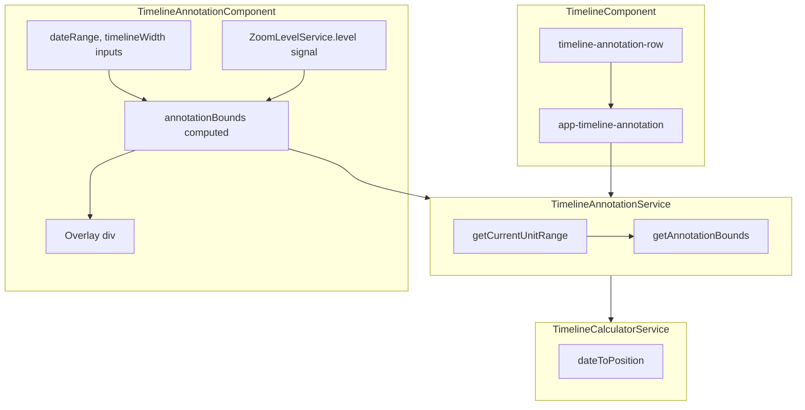

# Current Unit Annotation in Timeline

## Approach

Extract the current-unit annotation into a dedicated **TimelineAnnotationComponent** and **TimelineAnnotationService**. The timeline uses the component in the annotation row; the service encapsulates all date/position logic.

## Architecture




## Implementation

### 1. Create TimelineAnnotationService

**New file:** `work-order-schedule/src/app/services/timeline-annotation.service.ts`

- Inject `TimelineCalculatorService`
- `getCurrentUnitRange(zoomLevel: ZoomLevel): { start: Date; end: Date }` – returns the current unit boundaries:


| Zoom Level | Unit Start                         | Unit End                 |
| ---------- | ---------------------------------- | ------------------------ |
| **month**  | 1st of current month, 00:00        | 1st of next month, 00:00 |
| **week**   | Monday 00:00 of current week (ISO) | Next Monday 00:00        |
| **day**    | Today 00:00                        | Tomorrow 00:00           |
| **hours**  | Current hour start                 | Next hour start          |


- `getAnnotationBounds(zoomLevel, dateRange, pixelWidth): { left: number; width: number } | null` – uses `dateToPosition` with `clamp: false`, clamps to visible area, returns `null` when unit is fully outside range or width <= 0

### 2. Create TimelineAnnotationComponent

**New file:** `work-order-schedule/src/app/components/timeline/timeline-annotation.component.ts`

- Inputs: `dateRange`, `timelineWidth` (from parent timeline)
- Inject `TimelineAnnotationService` and `ZoomLevelService`
- Use `zoomService.level()` in the computed so the annotation reacts to zoom changes in real time via the signal
- `annotationBounds = computed(() => this.annotationService.getAnnotationBounds(this.zoomService.level(), this.dateRange(), this.timelineWidth()))`
- Template: `@if (annotationBounds(); as ann) { <div class="current-unit-annotation" [style.left.px]="ann.left" [style.width.px]="ann.width"></div> }`
- Styles: `position: absolute`, `top: 0; bottom: 0`, `background: rgba(62, 64, 219, 0.08)`, `pointer-events: none`, `z-index: 1`

### 3. Use the component in TimelineComponent

**File:** [work-order-schedule/src/app/components/timeline/timeline.component.ts](work-order-schedule/src/app/components/timeline/timeline.component.ts)

- Import `TimelineAnnotationComponent`
- Inside `.timeline-annotation-row`, add:

```html
<app-timeline-annotation
  [dateRange]="dateRange()"
  [timelineWidth]="timelineWidth()"
/>
```

- Keep the existing scale-boundary divs in the annotation row. No `zoomLevel` input – the annotation injects `ZoomLevelService` and reads the signal directly for real-time response.

### 4. Week start convention

Using **ISO week** (Monday start) for the "current week" definition.

### 5. Test coverage

**New file:** `work-order-schedule/src/app/services/timeline-annotation.service.spec.ts`

- Use `jasmine.clock().install()` and `jasmine.clock().mockDate(fixedDate)` to freeze time for deterministic tests
- `getCurrentUnitRange('month')`: assert start is 1st of month 00:00, end is 1st of next month 00:00
- `getCurrentUnitRange('week')`: assert start is Monday 00:00, end is next Monday 00:00 (ISO week)
- `getCurrentUnitRange('day')`: assert start is today 00:00, end is tomorrow 00:00
- `getCurrentUnitRange('hours')`: assert start is current hour 00:00, end is next hour 00:00
- `getAnnotationBounds`: when unit is inside visible range, return `{ left, width }` with width > 0
- `getAnnotationBounds`: when unit is fully outside range, return `null`
- `getAnnotationBounds`: when unit partially overlaps, return clamped bounds

**New file:** `work-order-schedule/src/app/components/timeline/timeline-annotation.component.spec.ts`

- Provide `TimelineAnnotationService`, `ZoomLevelService`, `TimelineCalculatorService`
- Set inputs: `dateRange` (range containing "now"), `timelineWidth`
- Use `jasmine.clock().mockDate()` so the current unit is predictable
- Assert overlay div is rendered when bounds exist (has `.current-unit-annotation`, correct `left`/`width` styles)
- Assert overlay is not rendered when `getAnnotationBounds` returns null (e.g. range excludes "now")
- Assert annotation updates when `ZoomLevelService.setLevel()` is called (change zoom, verify overlay position/size changes)

## Files Changed


| File                                                        | Changes                                                      |
| ----------------------------------------------------------- | ------------------------------------------------------------ |
| `services/timeline-annotation.service.ts`                   | **New** – getCurrentUnitRange, getAnnotationBounds           |
| `services/timeline-annotation.service.spec.ts`              | **New** – service unit tests with mocked time                |
| `components/timeline/timeline-annotation.component.ts`      | **New** – component with inputs, computed, overlay template  |
| `components/timeline/timeline-annotation.component.spec.ts` | **New** – component tests                                    |
| `components/timeline/timeline.component.ts`                 | Import and use `<app-timeline-annotation>` in annotation row |


