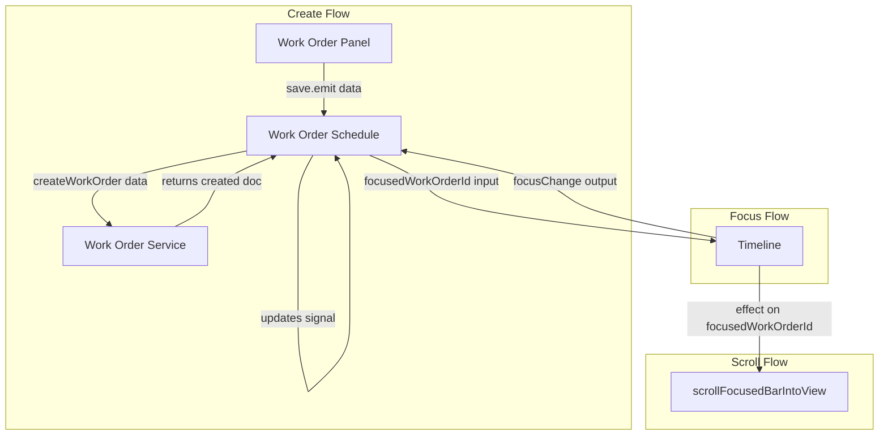

# Focus New Work Order in Timeline After Create

## Current Behavior

- **Create flow**: [work-order-schedule.component.ts](work-order-schedule/src/app/components/work-order-schedule/work-order-schedule.component.ts) `onPanelSave` calls `workOrderService.createWorkOrder(data)` but does not capture the returned document.
- **Focus state**: The timeline owns `focusedWorkOrderId` internally ([timeline.component.ts](work-order-schedule/src/app/components/timeline/timeline.component.ts) line 386). There is no way for the parent to set focus.
- **Scroll into view**: `scrollFocusedBarIntoView(rowIndex)` exists and is used for keyboard navigation (line 855).

## Approach

Lift `focusedWorkOrderId` to the parent (`WorkOrderScheduleComponent`) so it can be set after create. The timeline will receive it as input and emit when the user changes focus (click/keyboard).

## Implementation

### 1. Work Order Schedule Component

**File**: [work-order-schedule.component.ts](work-order-schedule/src/app/components/work-order-schedule/work-order-schedule.component.ts)

- Add `focusedWorkOrderId = signal<string | null>(null)`.
- Pass to timeline: `[focusedWorkOrderId]="focusedWorkOrderId()"` and `(focusChange)="onTimelineFocusChange($event)"`.
- Add handler: `onTimelineFocusChange(workOrder: WorkOrderDocument | null): void { this.focusedWorkOrderId.set(workOrder?.docId ?? null); }`
- In `onPanelSave` (create branch): capture the created document and set focus:
  ```ts
  const created = this.workOrderService.createWorkOrder(data);
  this.focusedWorkOrderId.set(created.docId);
  ```

### 2. Timeline Component

**File**: [timeline.component.ts](work-order-schedule/src/app/components/timeline/timeline.component.ts)

- Replace internal `focusedWorkOrderId = signal<string | null>(null)` with `focusedWorkOrderId = input<string | null>(null)`.
- Add `focusChange = output<WorkOrderDocument | null>()`.
- In `onBarFocus`: emit `focusChange.emit(workOrder)` instead of setting the signal; keep `scrollContainerRef?.nativeElement?.focus()`.
- In `onKeydown` (arrow navigation): emit `focusChange.emit(next)` instead of `focusedWorkOrderId.set(next.docId)`.
- Update the effect (lines 430–435) that clears focus when work order no longer exists: emit `focusChange.emit(null)` when the focused id is invalid.
- Add an effect to scroll the focused bar into view when `focusedWorkOrderId` changes: use `buildNavItems()` to find the row index by docId, then call `scrollFocusedBarIntoView(rowIndex)`.

### 3. Optional: Extend Date Range When New Order Is Outside

If the new work order's dates fall outside the visible range, it will not appear in `workOrdersInRange`. Consider calling `rangeService.extendToIncludeDate()` for the new order's start/end dates before focusing, so the bar is visible. This can be a follow-up if the initial implementation shows the bar is often off-screen.

## Data Flow



## Testing

- Unit: In `work-order-schedule.component.spec.ts`, verify that after `onPanelSave` in create mode, `focusedWorkOrderId` is set to the created doc's id.
- E2E: Extend create flow tests to assert the new bar has the focused class and is visible after creation.
