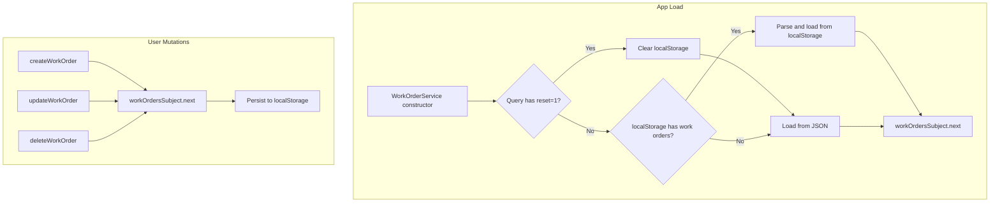

# LocalStorage Persistence with Reset Querystring

## Summary

Persist work orders to `localStorage` so changes survive page refreshes. Work centers remain loaded from JSON (static). A hidden querystring `?reset=1` clears stored data and reloads from the default JSON.

## Data Flow



## Implementation

### 1. WorkOrderService changes ([work-order.service.ts](work-order-schedule/src/app/services/work-order.service.ts))

**Storage key and reset param:**
- `STORAGE_KEY = 'work-order-schedule:work-orders'`
- Reset querystring: `?reset=1` (obscure, not user-facing)

**Load logic (replace current `loadData()`):**
1. Check `window.location.search` for `reset=1` (use `URLSearchParams`).
2. If reset: `localStorage.removeItem(STORAGE_KEY)`, then load work orders from JSON (same as today).
3. If not reset: try `localStorage.getItem(STORAGE_KEY)`. If valid JSON array, parse and `workOrdersSubject.next(parsed)`. Otherwise load from JSON.
4. Work centers: always load from JSON (unchanged).

**Persistence:**
- After `createWorkOrder`, `updateWorkOrder`, and `deleteWorkOrder`: call a private `persistWorkOrders()` that does `localStorage.setItem(STORAGE_KEY, JSON.stringify(orders))`.

**Platform safety:**
- Use `typeof window !== 'undefined'` before accessing `localStorage` and `location` (app has no SSR, but keeps tests safe when `window` may be absent).

### 2. Platform / window access

Inject nothing extra. Use a simple guard:

```typescript
private get canUseStorage(): boolean {
  return typeof window !== 'undefined' && typeof window.localStorage !== 'undefined';
}
```

For querystring: `new URLSearchParams(window.location.search).get('reset') === '1'`.

### 3. Unit tests ([work-order.service.spec.ts](work-order-schedule/src/app/services/work-order.service.spec.ts))

- **beforeEach:** `localStorage.clear()` to avoid cross-test pollution.
- Add test: "should persist work orders to localStorage on create" – create order, assert `localStorage.getItem(STORAGE_KEY)` contains the new order.
- Add test: "should load work orders from localStorage when available" – set `localStorage` with valid JSON before service init, flush HTTP, assert loaded orders match.
- Add test: "should reset from JSON when ?reset=1" – mock `window.location.search = '?reset=1'`, set localStorage, init service, flush HTTP, assert orders come from JSON and localStorage is cleared. (Requires a way to set `location.search` – in Karma/browser, we can use `history.replaceState` + `location.search` or a test-specific override. Simplest: use `Object.defineProperty` to stub `location.search` in that test.)

### 4. E2E test (optional)

Add a scenario: load app, create work order, refresh page, assert bar still exists. Then visit `/?reset=1`, assert data resets to default (e.g., the created bar is gone if it wasn’t in the default JSON).

## File Changes

| File | Changes |
|------|---------|
| [work-order.service.ts](work-order-schedule/src/app/services/work-order.service.ts) | Add `STORAGE_KEY`, `canUseStorage`, `persistWorkOrders()`, reset check and localStorage load in `loadData()`, call `persistWorkOrders()` in create/update/delete |
| [work-order.service.spec.ts](work-order-schedule/src/app/services/work-order.service.spec.ts) | `localStorage.clear()` in beforeEach; add tests for persist, load from storage, reset |

## Edge Cases

- **Corrupt JSON in localStorage:** Catch `JSON.parse` errors; on error, clear key and load from JSON.
- **localStorage full:** Catch `QuotaExceededError`; log and continue without persistence.
- **SSR / no window:** Guard with `typeof window !== 'undefined'`; skip storage and reset logic.
