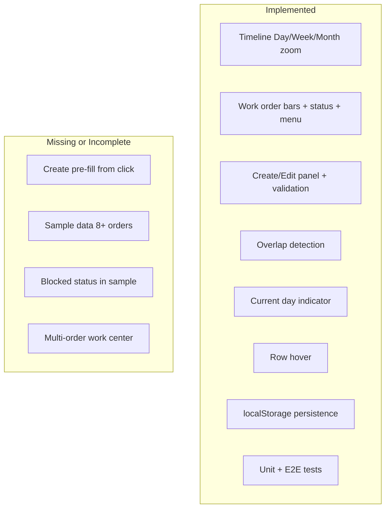

# Requirements Fulfillment Analysis

## Documents Analyzed

- **[docs/Outline.md](docs/Outline.md)** — Original technical spec (frontend take-home)
- **[docs/REQUIREMENTS.md](docs/REQUIREMENTS.md)** — Consolidated requirements (Outline + transcript + agent decisions)
- **[docs/TODO.md](docs/TODO.md)** — Future upgrades only (Angular 21)

---

## Implementation Status Overview

---

## 1. Must-Have Gaps (Required by Spec)

### 1.1 Create Panel Pre-fill from Click (FR-5)

**Requirement:** Click empty timeline area → open Create panel with Start Date pre-filled from click position, End Date = Start + 7 days.

**Current state:** `initialDate` is passed from [work-order-schedule.component.ts](work-order-schedule/src/app/components/work-order-schedule/work-order-schedule.component.ts) via `clickContext()?.date`, but [work-order-panel.component.ts](work-order-schedule/src/app/components/work-order-panel/work-order-panel.component.ts) does not use it. The effect (lines 473–491) always sets `startDate: null` and `endDate: null` in create mode.

**Fix:** In the panel effect, when `mode() === 'create'` and `initialDate()` is set, patch the form with:

- `startDate` = `dateToNgb(initialDate())`
- `endDate` = `dateToNgb(initialDate() + 7 days)`

---

### 1.2 Sample Data (DR-1 through DR-5)

**Requirements:**

| Requirement                                     | Current                     | Target                       |
| ----------------------------------------------- | --------------------------- | ---------------------------- |
| 5+ work centers                                 | 5                           | Met                          |
| 8+ work orders                                  | 5                           | Need 3 more                  |
| All 4 status types                              | open, in-progress, complete | Add **blocked**              |
| One center with multiple non-overlapping orders | None                        | Add 2+ orders on same center |
| Different date ranges                           | Yes                         | Met                          |

**Files to update:**

- [work-order-schedule/src/app/data/sample-data.ts](work-order-schedule/src/app/data/sample-data.ts) — fallback data
- [work-order-schedule/public/data/work-orders.json](work-order-schedule/public/data/work-orders.json) — runtime JSON (used by `WorkOrderService`)

**Suggested changes:**

1. Add 3+ work orders (total ≥ 8).
2. Add at least one order with `status: 'blocked'`.
3. Add 2+ non-overlapping orders on the same work center (e.g., Extrusion Line A or CNC Machine 1).

---

## 2. Deliverables Checklist

| ID  | Deliverable                                       | Status               |
| --- | ------------------------------------------------- | -------------------- |
| D-1 | Working Angular app (`ng serve`)                  | Done                 |
| D-2 | Pixel-perfect implementation per Sketch           | Needs verification   |
| D-3 | Sample data (5+ centers, 8+ orders, all statuses) | Incomplete (see 1.2) |
| D-4 | README with setup and run instructions            | Done                 |
| D-5 | 5–10 minute Loom demo                             | Unknown (manual)     |
| D-6 | Public GitHub/GitLab repo with clean history      | Unknown (manual)     |

---

## 3. Already Implemented (No Action)

- **FR-1–FR-4, FR-6–FR-13:** Timeline zoom, bars, menu, overlap, panel, current day, row hover, fixed left panel
- **Default timescale Month:** [zoom-level.service.ts](work-order-schedule/src/app/services/zoom-level.service.ts) defaults to `'month'` (per REQUIREMENTS FR-2)
- **TR-1–TR-7:** Angular 20, TypeScript strict, SCSS, Reactive Forms, ng-select, ngb-datepicker, document structure
- **V-1–V-5:** Form validation and overlap rules
- **Bonus:** localStorage, unit/E2E tests, panel/bar animations, custom datepicker formatter, bar tooltip (name only), extend-on-scroll, wheel zoom

---

## 4. Optional / Bonus Gaps

| Feature                                  | Status              |
| ---------------------------------------- | ------------------- |
| Escape to close panel                    | Not implemented     |
| "Today" button                           | Not implemented     |
| Full bar tooltip (name + status + dates) | Partial — name only |
| OnPush / trackBy                         | Not implemented     |
| ARIA / accessibility                     | Not implemented     |

---

## 5. Recommended Implementation Order

1. **Create panel pre-fill** — Small, high-impact change in `work-order-panel.component.ts`.
2. **Sample data** — Update `sample-data.ts` and `public/data/work-orders.json` to meet DR-2, DR-3, DR-4.
3. **Pixel-perfect verification** — Compare against Sketch and [UI-THEME-DESIGN-DOCUMENT.md](docs/UI-THEME-DESIGN-DOCUMENT.md).
4. **Loom demo** — Record 5–10 min walkthrough (manual).
5. **Bonus features** — Escape key, "Today" button, full tooltip, accessibility (as time allows).

