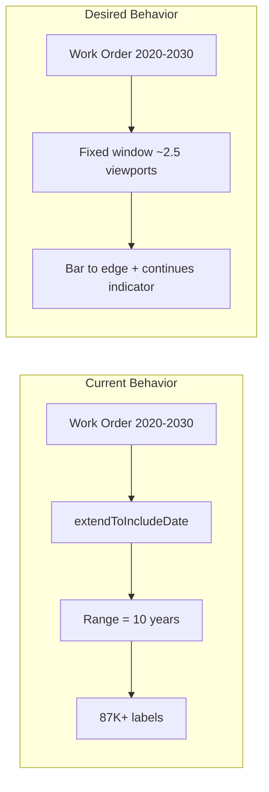

# Timeline Continuous Visual Performance Fix

## Problem

When work orders span outside the configured window (e.g., a 10-year order at hour zoom), the current logic expands the entire date range to include them. This causes:

- **`extendToIncludeDate`** (effect in [timeline.component.ts](work-order-schedule/src/app/components/timeline/timeline.component.ts) lines 376-388) expands the range to min/max of all work orders
- **`extendForward`** with `minEndDate` (line 589) jumps the range to the furthest work order end when scrolling
- **`getHeaderLabels`** iterates over the full range — at hour zoom over 10 years that is ~87,600 labels
- **`getTimelineWidth`**, **`scaleBoundaryPositions`**, and header cells scale with this, creating massive DOM and layout cost

## Solution

Keep the window fixed to the configured size. When a work order extends outside, render a **continuous bar to the edge** with a visual indicator that it continues, until the user scrolls and the actual start/end becomes visible.

## Implementation

### 1. Remove range expansion for work orders

**File:** [timeline.component.ts](work-order-schedule/src/app/components/timeline/timeline.component.ts)

Remove or disable the effect (lines 376-388) that calls `extendToIncludeDate` for `minStart` and `maxEnd` of work orders. The window stays at its configured sliding-window size.

### 2. Stop jumping range on scroll

**File:** [timeline.component.ts](work-order-schedule/src/app/components/timeline/timeline.component.ts)

In `checkExtendAtEdges`, stop passing `minEnd` to `extendForward` (lines 589, 643). Extend only by the chunk size when the user scrolls to the edge. The range grows incrementally as the user pans, not in one jump to the furthest work order.

### 3. Clamp bar to visible area and add continuation flags

**File:** [timeline-row.component.ts](work-order-schedule/src/app/components/timeline/timeline-row.component.ts)

Update `barPositions` computed:

- Compute `left` and `right` with `{ clamp: false }` (unchanged)
- Clamp to visible area: `visibleLeft = max(0, left)`, `visibleRight = min(width, right)`
- Set `barLeft = visibleLeft`, `barWidth = visibleRight - visibleLeft`
- Add `continuesLeft: left < 0`, `continuesRight: right > width`
- Pass these flags to `app-work-order-bar`

### 4. Render continuation indicators on work order bar

**File:** [work-order-bar.component.ts](work-order-schedule/src/app/components/timeline/work-order-bar.component.ts)

- Add inputs: `continuesLeft`, `continuesRight`
- When `continuesLeft`: add a left-edge visual (e.g., gradient fade or chevron) indicating the bar continues into the past
- When `continuesRight`: add a right-edge visual indicating it continues into the future
- Use CSS (e.g., `::before`/`::after` pseudo-elements with gradients or a small caret) for a lightweight, performant indicator

### 5. Tests and edge cases

- Update or add tests for `barPositions` when work order extends before/after range
- Ensure `getOrdersForCenter` still includes overlapping work orders (current overlap logic is correct)
- Verify scroll-to-extend still works when user pans to edges (chunked extension only)

## Key Files

| File | Change |
|------|--------|
| [timeline.component.ts](work-order-schedule/src/app/components/timeline/timeline.component.ts) | Remove extendToIncludeDate effect; stop passing minEndDate to extendForward |
| [timeline-row.component.ts](work-order-schedule/src/app/components/timeline/timeline-row.component.ts) | Clamp bar to visible area; add continuesLeft/continuesRight |
| [work-order-bar.component.ts](work-order-schedule/src/app/components/timeline/work-order-bar.component.ts) | Add continuation indicator visuals |

## Consequences

- **Positive:** Header labels, scale boundaries, and timeline width stay bounded by the window; no explosion when work orders span years
- **Positive:** User can still scroll/pan to see actual start/end; range extends by chunks
- **Neutral:** Work orders extending beyond the window show a "continues" indicator instead of the full bar until scrolled into view
