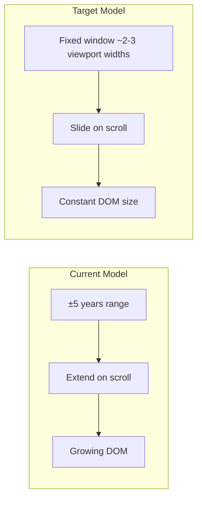
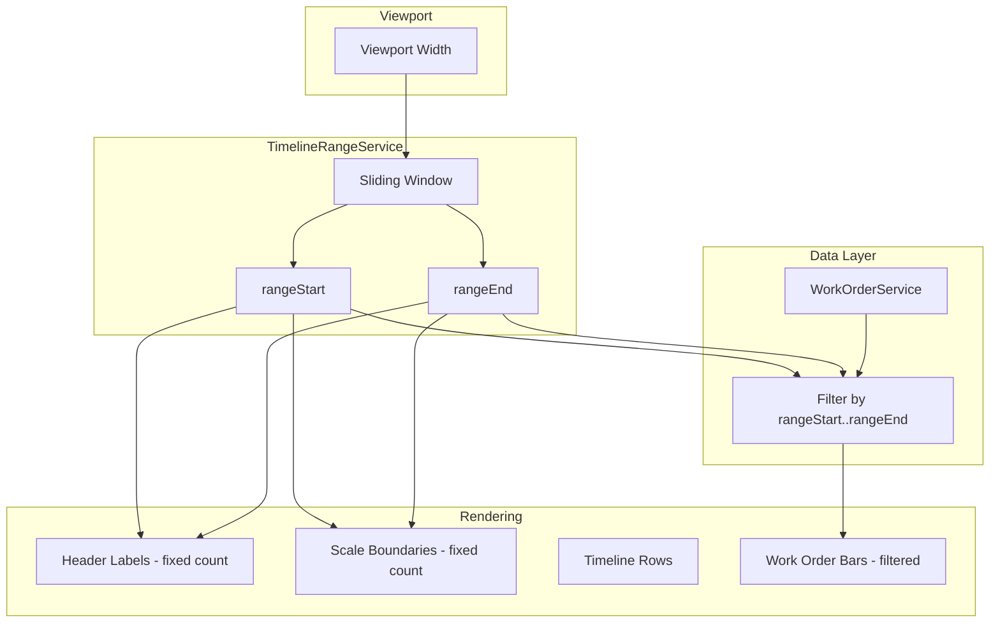

# Timeline Performance Optimization Plan

## Problem Summary

The timeline currently suffers from severe performance degradation at granular zoom levels:

| Zoom  | Labels/Cells | Approx. DOM nodes               |
| ----- | ------------ | ------------------------------- |
| hours | ~87,600      | 175k+ (labels + boundaries × 2) |
| day   | ~3,650       | 7k+                             |
| week  | ~520         | 1k+                             |
| month | ~120         | 240+                            |

- **Range**: ±5 years (`TIMELINE_RANGE_YEARS`) from today; extends further on scroll
- **Rendering**: All header labels, scale boundaries, and work order bars are created in DOM
- **Data**: All work orders loaded from JSON/localStorage; no filtering by visible range
- **Memory**: Full range + all work orders held in memory

## Architecture Change: Sliding Window

**Key change**: Instead of extending the range when scrolling near edges, we **slide** the window: drop data from one side, add to the other. The number of time units (and thus DOM nodes) stays constant.

## Implementation Plan

### 1. Sliding Window Range Service

**File**: [timeline-range.service.ts](work-order-schedule/src/app/services/timeline-range.service.ts)

- Replace `extendBackward` / `extendForward` with `slideBackward` / `slideForward`
- On slide: update both `rangeStart` and `rangeEnd` by the chunk amount (window size stays fixed)
- Add `setViewportWidth(px: number)` so the service can compute window size in time units from viewport width
- Window size formula: `viewportWidth / cellWidth * bufferMultiplier` (e.g. 2.5x viewport = smooth scroll with buffer)

**New behavior**:

- `initialize(zoomLevel)` sets a fixed window (e.g. 6 months at month zoom, 14 days at day zoom, 168 hours at hour zoom)
- On scroll near left edge: `slideBackward()` → `rangeStart -= chunk`, `rangeEnd -= chunk`, adjust `scrollLeft` so the user sees the same content
- On scroll near right edge: `slideForward()` → `rangeStart += chunk`, `rangeEnd += chunk`, adjust `scrollLeft`

### 2. Timeline Component: Viewport Tracking and Scroll Handling

**File**: [timeline.component.ts](work-order-schedule/src/app/components/timeline/timeline.component.ts)

- Inject `ResizeObserver` or use `ElementRef` + `clientWidth` to pass viewport width to `TimelineRangeService`
- Update `onScroll()` to call `slideBackward` / `slideForward` instead of `extendBackward` / `extendForward`
- When sliding, compute `addedWidth` (or `deltaScroll`) and set `scrollLeft` to preserve the user's view (same logic as current `extendBackward` but for slide: `scrollLeft -= chunkWidth` on backward slide)

### 3. Timeline Calculator: Window-Size Helpers

**File**: [timeline-calculator.service.ts](work-order-schedule/src/app/services/timeline-calculator.service.ts)

- Add `getWindowUnitsForViewport(viewportPx: number, zoomLevel: ZoomLevel, bufferMultiplier?: number): number` to compute how many time units fit in the window
- Add `getChunkSize(zoomLevel: ZoomLevel): number` (reuse or align with `EXTEND_CHUNK_DAYS`) for slide chunk size
- Reduce `TIMELINE_RANGE_YEARS` usage: initial range will come from the sliding window, not ±5 years

### 4. Work Order Filtering by Visible Range

**File**: [timeline.component.ts](work-order-schedule/src/app/components/timeline/timeline.component.ts)

- Change `getOrdersForCenter(workCenterId)` to filter by `dateRange()`: only return work orders whose `[startDate, endDate]` overlaps `[rangeStart, rangeEnd]`
- This reduces data passed to each row and avoids rendering bars that are off-screen

**File**: [timeline-row.component.ts](work-order-schedule/src/app/components/timeline/timeline-row.component.ts)

- No changes required; it already receives filtered work orders and computes bar positions

### 5. Range-Based Data Loading Interface (Phase 2)

**File**: [work-order.service.ts](work-order-schedule/src/app/services/work-order.service.ts)

- Add `loadWorkOrdersForRange(start: Date, end: Date): Observable<WorkOrderDocument[]>` 
- **Initial implementation**: Filter in-memory `workOrdersSubject.value` by date range and return `of(filtered)`
- **Future**: Swap implementation to `http.get(\`/api/work-orders?start=...&end=...)` when backend exists
- Add `workOrdersInRange = signal<WorkOrderDocument[]>([])` and have the timeline subscribe to range changes to trigger `loadWorkOrdersForRange` and update the signal

**Alternative (simpler for now)**: Keep all work orders in memory but filter before passing to timeline. The filtering in step 4 achieves most of the benefit. The range-based loading interface can be added later when an API exists.

### 6. Initial Window Size Configuration

**File**: [timeline-calculator.service.ts](work-order-schedule/src/app/services/timeline-calculator.service.ts) or new constants

- Define sensible default window sizes per zoom (e.g. month: 12, day: 60, week: 12, hours: 168)
- These should roughly fill 2–3 viewport widths to allow smooth scrolling before triggering a slide

## Data Flow After Changes

## Files to Modify

| File                                                                                                  | Changes                                                           |
| ----------------------------------------------------------------------------------------------------- | ----------------------------------------------------------------- |
| [timeline-range.service.ts](work-order-schedule/src/app/services/timeline-range.service.ts)           | Sliding window logic, viewport-based window size                  |
| [timeline-calculator.service.ts](work-order-schedule/src/app/services/timeline-calculator.service.ts) | Window size helpers, optional chunk helpers                       |
| [timeline.component.ts](work-order-schedule/src/app/components/timeline/timeline.component.ts)        | Viewport tracking, slide on scroll, work order filtering by range |
| [work-order.service.ts](work-order-schedule/src/app/services/work-order.service.ts)                   | Optional: `loadWorkOrdersForRange` interface (can defer)          |

## Testing Considerations

- Update [timeline-calculator.service.spec.ts](work-order-schedule/src/app/services/timeline-calculator.service.spec.ts) for new helpers
- Update [timeline-range.service](work-order-schedule/src/app/services/) tests for slide behavior
- Add/update timeline component tests for scroll-to-slide behavior
- Verify work order filtering: bars outside range are not rendered

## Optional Enhancements (Out of Scope for Initial Plan)

- **Angular CDK Virtual Scroll**: For horizontal virtualization of header/scale cells if sliding window is insufficient
- **Canvas rendering**: For extreme scale (e.g. 100k+ units) if DOM remains a bottleneck
- **Backend API**: Implement `loadWorkOrdersForRange` with real HTTP when available

