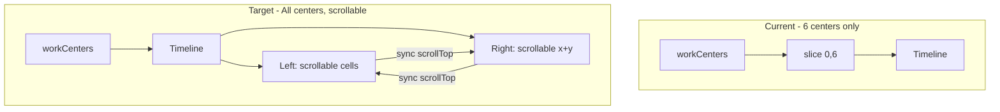

# Work Center Scrolling Window

## Current State

- [work-order-schedule.component.ts](work-order-schedule/src/app/components/work-order-schedule/work-order-schedule.component.ts) limits display to 6 work centers: `displayedWorkCenters = computed(() => this.workCenters().slice(0, 6))`
- [timeline.component.ts](work-order-schedule/src/app/components/timeline/timeline.component.ts) uses a two-column layout: `timeline-left` (380px fixed, work center names) and `timeline-right` (scrollable timeline with `overflow-x: auto; overflow-y: auto`)
- The left column has no scroll; with many work centers it would overflow and clip
- `TimelineWheelZoomDirective` on the right panel captures wheel for zoom (month/week/day/hours), not vertical scroll
- Per ADR-004: scrollbars are hidden, drag pans horizontally

## Architecture

## Implementation Plan

### 1. Remove Work Center Limit

In [work-order-schedule.component.ts](work-order-schedule/src/app/components/work-order-schedule/work-order-schedule.component.ts):

- Remove `displayedWorkCenters` computed and pass `workCenters()` directly to the timeline
- Update template: `[workCenters]="workCenters()"` instead of `displayedWorkCenters()`

### 2. Make Left Column Vertically Scrollable

In [timeline.component.ts](work-order-schedule/src/app/components/timeline/timeline.component.ts):

- Wrap the work center cells in a scrollable container: `timeline-left-cells-scroll`
- Structure:
  - `timeline-left-header` (fixed)
  - `timeline-annotation-spacer` (fixed)
  - `timeline-left-cells-scroll` (new: `flex: 1`, `min-height: 0`, `overflow-y: auto`, `scrollbar-width: none`)
    - Contains the `@for` loop of `timeline-left-cell` elements
  - Remove `timeline-left-filler` (no longer needed; cells provide scroll height)
- Apply same scrollbar-hiding styles as the right panel for consistency

### 3. Sync Vertical Scroll Between Left and Right

- Add `@ViewChild` for the left cells scroll container
- Implement two-way scroll sync:
  - On left `scroll`: set `right.scrollTop = left.scrollTop` (with a guard to avoid re-entrancy)
  - On right `scroll`: set `left.scrollTop = right.scrollTop` (same guard)
- Use a simple flag (e.g. `private syncingScroll = false`) to prevent feedback loops when programmatically updating scrollTop

### 4. Wheel Over Work Center Column Scrolls the Grid

- The left cells container has `overflow-y: auto`; when the user wheels over it, the browser will scroll it by default
- The scroll sync (step 3) will propagate to the right, so the whole grid scrolls together
- No custom wheel handler needed on the left; native scroll behavior suffices
- The right panel keeps `appTimelineWheelZoom` for zoom when hovering over the timeline content

### 5. Ensure Equal Scroll Heights

- The left cells area height = `48px * workCenters.length`
- The right `timeline-rows` height = `48px * workCenters.length` (each `app-timeline-row` is 48px)
- Heights already match; sync will keep them aligned

## Key Files

| File | Changes |
|------|---------|
| [work-order-schedule.component.ts](work-order-schedule/src/app/components/work-order-schedule/work-order-schedule.component.ts) | Remove `displayedWorkCenters`, pass `workCenters()` |
| [timeline.component.ts](work-order-schedule/src/app/components/timeline/timeline.component.ts) | Add scrollable left cells wrapper, scroll sync logic, template/layout updates |

## Edge Cases

- **Few work centers**: Left and right will not overflow; scroll sync is a no-op when there is no scroll
- **Initial scroll position**: Both start at 0; no special handling
- **scrollToShowNow()**: Only adjusts `scrollLeft`; no change needed
- **Resize**: Both containers resize; sync continues to work

## Optional Follow-Up: Virtual Scrolling

For very large datasets (e.g. 500+ work centers), consider adding `@angular/cdk/scrolling` and `cdk-virtual-scroll-viewport` to render only visible rows. This would require more structural changes and is out of scope for the initial implementation.
