# Work Order Schedule – User Guide

This guide describes how to use the Work Order Schedule Timeline application. Screenshots are captured automatically when you run the documentation test suite.

## Overview

The Work Order Schedule displays work orders as bars on a timeline, organized by work center. You can view the schedule at different zoom levels (Day, Week, Month), create new work orders, edit or delete existing ones, and the system prevents overlapping orders on the same work center.

---

## Timeline View

The main screen shows work centers in the left column and a scrollable timeline on the right. Each work order appears as a colored bar with its name and status.

### Changing the timescale

Use the **Timescale** dropdown to switch between:

- **Month** (default) – Best for planning across quarters
- **Week** – Useful for near-term scheduling
- **Day** – For detailed daily view

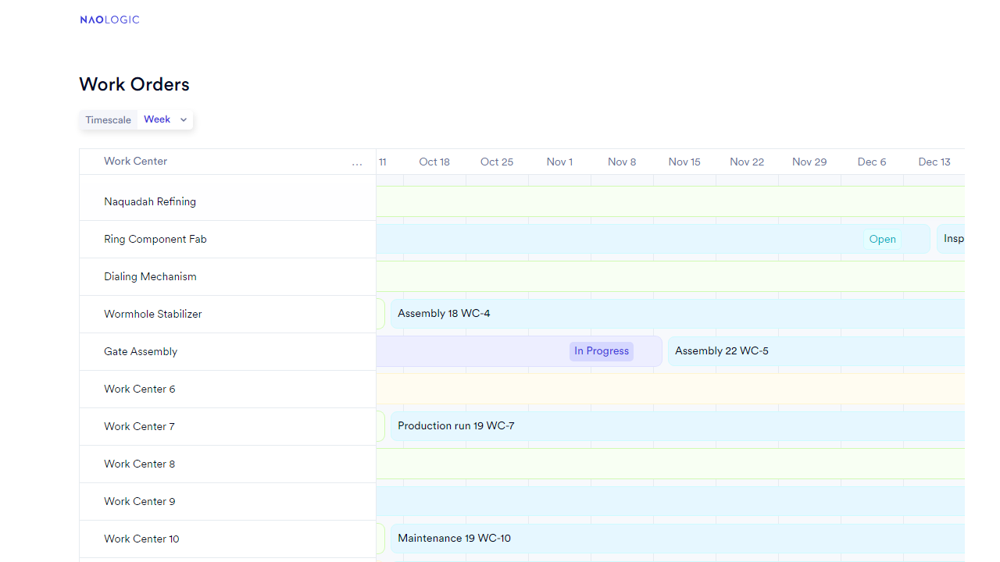

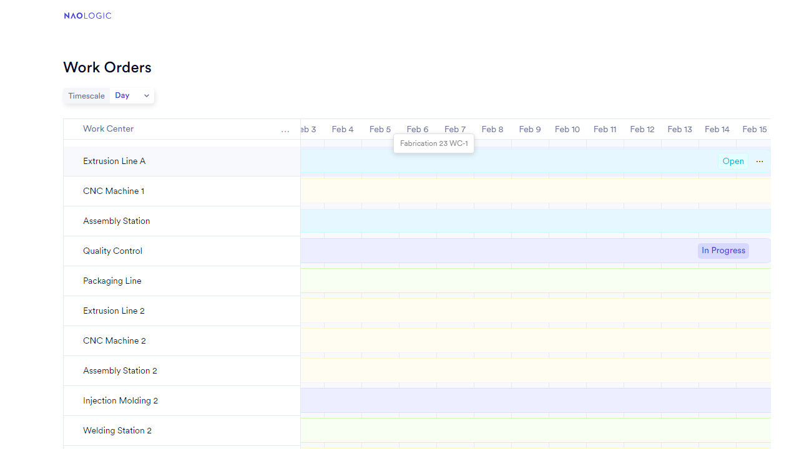

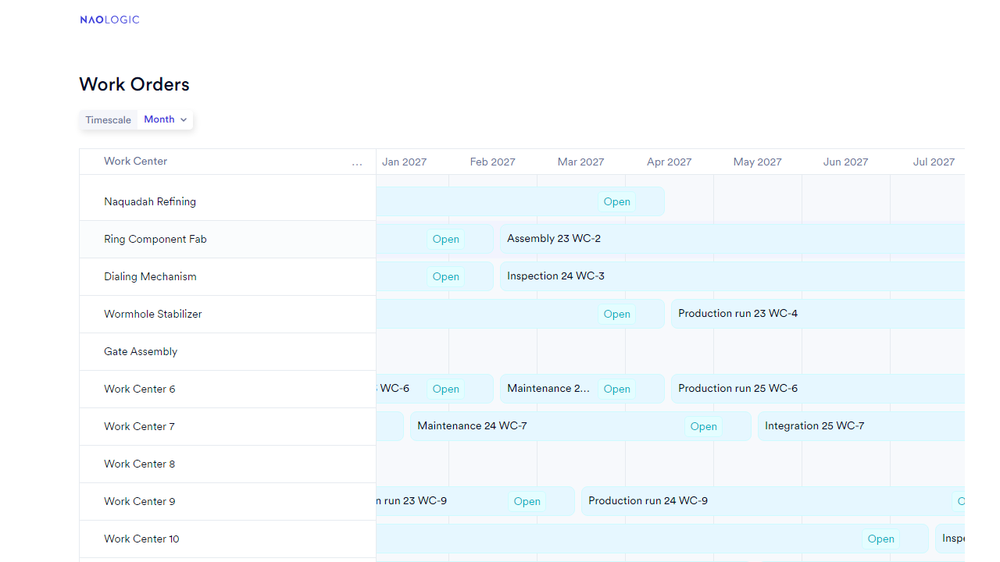

### Filtering work centers

Click the **⋯** (ellipsis) button next to "Work Center" to open the filter popover. You can filter by:

- **Name** – Case-insensitive text match on work center name
- **Date range** – Filter by start date, end date, or both. A work order is shown if any part of its range falls within the filter (overlap):
  - **Start date only** – Show work orders that end on or after that date
  - **End date only** – Show work orders that start on or before that date
  - **Both dates** – Show work orders that overlap the date range

---

## Creating a Work Order

1. **Click** on an empty area of a work center row. A hint "Click to add dates" appears when you hover over empty space.

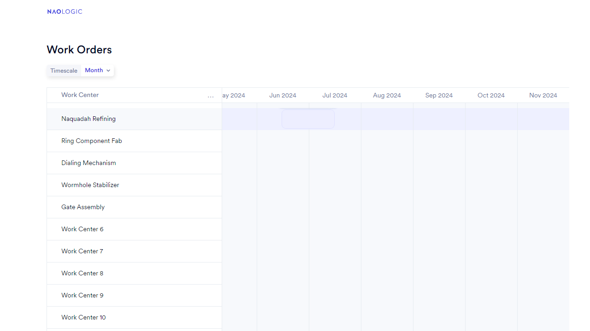

2. The **Work Order Details** panel opens from the right with the start date pre-filled based on where you clicked.

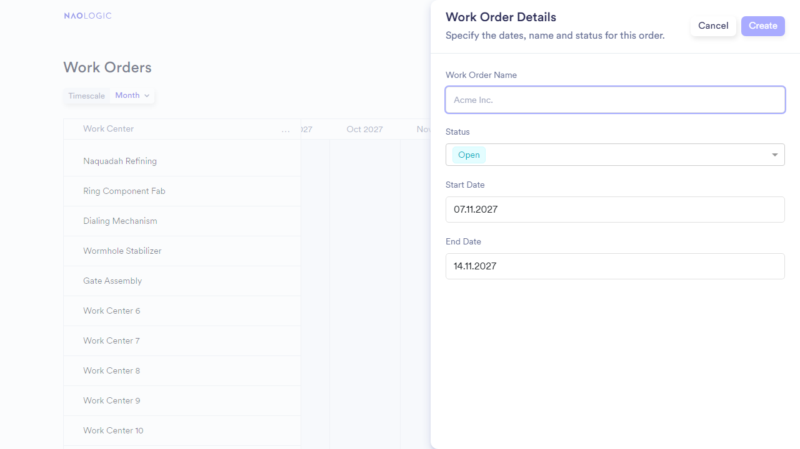

3. **Fill in** the form:
   - **Work Order Name** (required)
   - **Status** (Open, In Progress, Complete, Blocked)
   - **Start Date** – Click the field to open the date picker calendar
   - **End Date** – Click the field to open the date picker calendar

### Setting Start and End Dates

Click the **Start Date** or **End Date** field to open the date picker. A calendar popup appears where you can select a date. Use the arrow buttons to change the month or year, then click a day to select it.

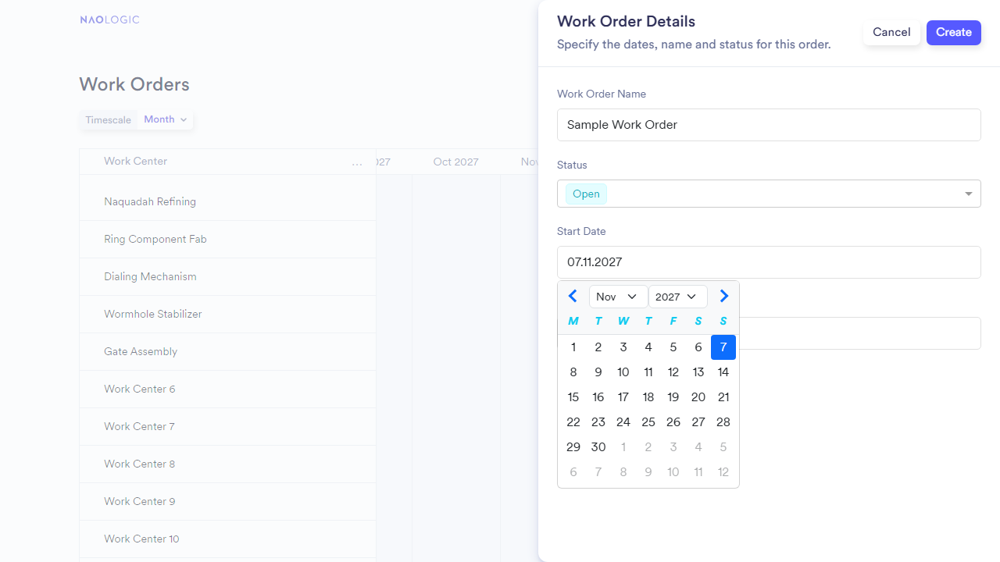

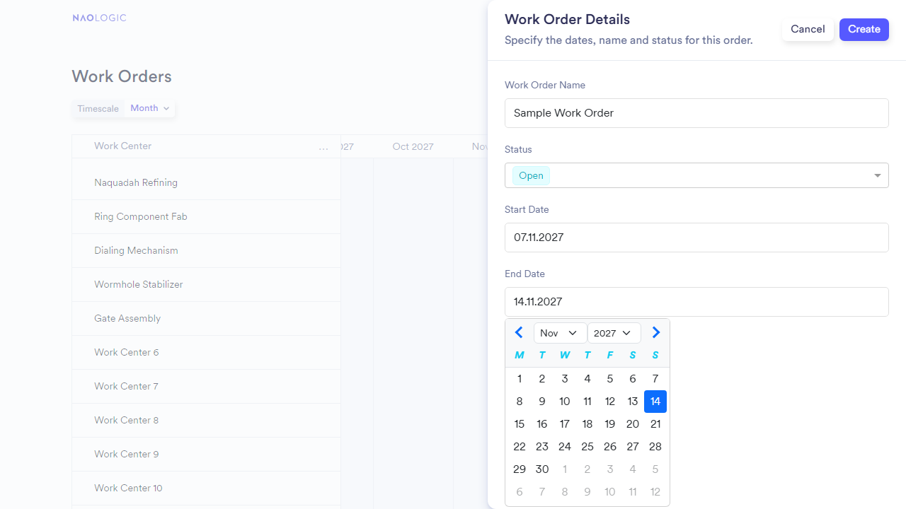

You can also type the date directly in DD.MM.YYYY format (e.g. `01.01.2030`).

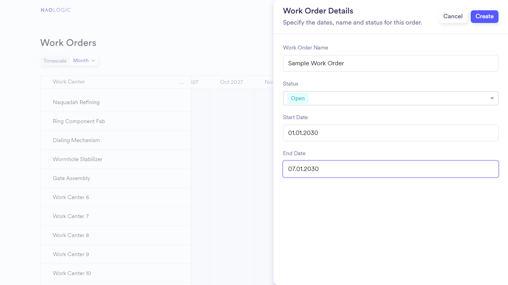

4. Click **Create**. The panel closes and the new work order bar appears on the timeline.

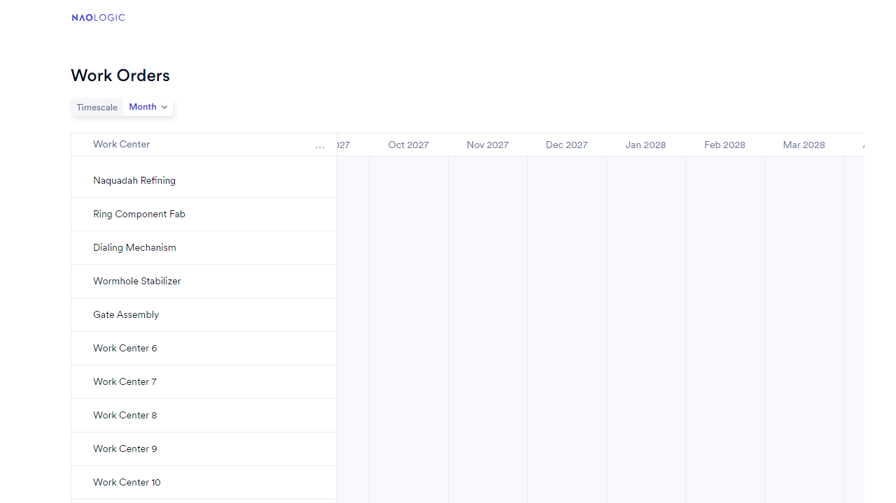

---

## Editing a Work Order

1. **Hover** over a work order bar. A three-dot menu (⋮) appears.

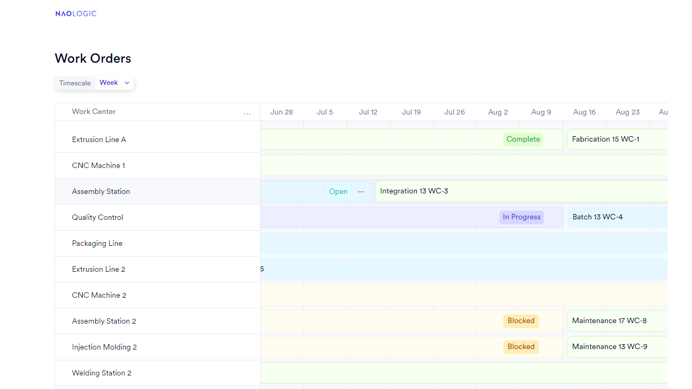

2. **Click** the menu button to open the dropdown with **Edit** and **Delete** options.

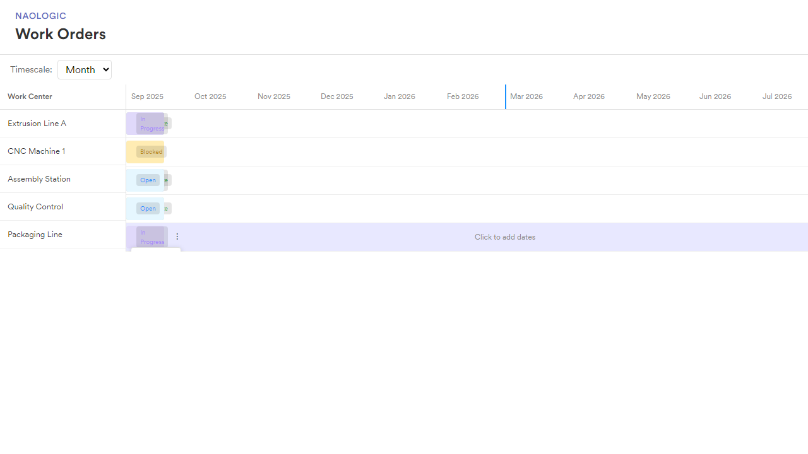

3. **Click Edit**. The Work Order Details panel opens with the existing data.

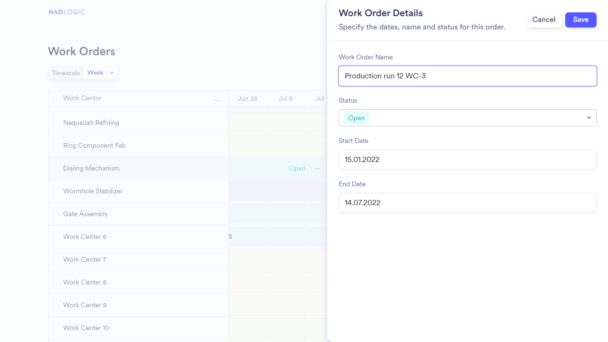

4. Make your changes and click **Save**, or click **Cancel** to close without saving.

---

## Keyboard Navigation

You can navigate the timeline and work orders using the keyboard:

1. **Focus the timeline** — Click on the timeline area or tab to it.
2. **Arrow keys** — Move focus between work order bars (Left/Right on the same row, Up/Down between rows).
3. **Enter** — Open the focused work order in the details panel.
4. **Escape** — Close the panel (when open). Focus returns to the timeline so you can continue navigating.

Use **`?empty`** or **`?empty=1`** in the URL to start with an empty timeline when demonstrating the create flow.

---

## Deleting a Work Order

1. Hover over the work order bar and click the three-dot menu.
2. Click **Delete** to show a confirmation.
3. Click **Delete** again to confirm. The work order is removed from the timeline immediately.

---

## Overlap Validation

The system does not allow two work orders on the same work center to overlap in time. If you try to create or save an order with overlapping dates, an error message is shown.

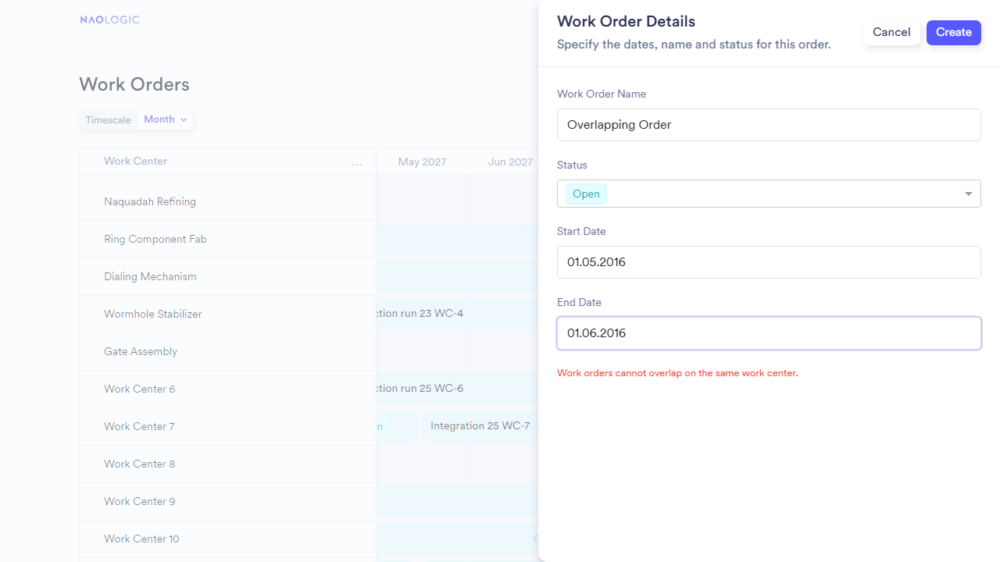

Adjust the start or end date to avoid the conflict, then try again.

---

## Canceling

To close the panel without saving:

1. Click **Cancel** in the panel, or
2. Click the dark overlay (backdrop) outside the panel.

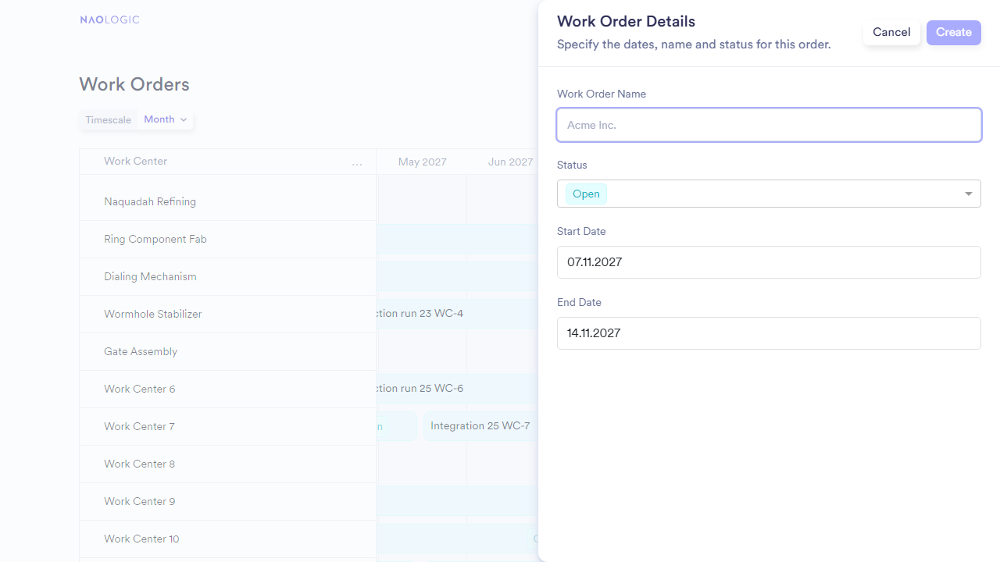

---

## Persistence and Reset

Work orders are saved automatically and persist across page refreshes.

- **`?reset=1`** — Clear stored data and reload from the default sample (e.g. `http://localhost:4200/?reset=1`).
- **`?empty`** or **`?empty=1`** — Clear stored data and start with no work orders (empty timeline). Use this to show the create flow (e.g. `http://localhost:4200/?empty`).

---

## Work Order Statuses

| Status       | Color  | Description                    |
| ------------ | ------ | ------------------------------ |
| Open         | Blue   | Not yet started                |
| In Progress  | Purple | Currently being worked on       |
| Complete     | Green  | Finished                       |
| Blocked      | Orange | Blocked or on hold             |

---

*This document is generated by the `user-documentation` E2E test suite. Run `npx playwright test --grep "User Documentation"` to refresh screenshots and regenerate.*
